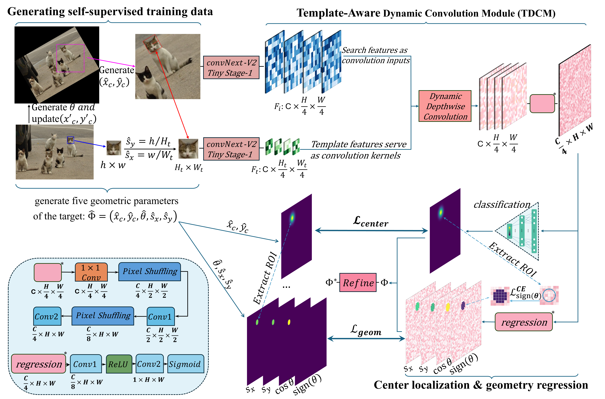

# PoseMatch-TDCM

This repository provides the official implementation of our paper:

**"An Efficient Deep Template Matching and In-Plane Pose Estimation Method via Template-Aware Dynamic Convolution"**  
*Published in Expert Systems with Applications*

## 🔧 Framework Architecture




## 🔍 Highlights

• End-to-end estimation of 2D geometric pose for planar template matching.  
• TDCM enables strong generalization to unseen targets with efficient matching.  
• Compact 3.07M model achieves robust matching and real-time speed under transformations.  
• A refinement module improves angle-scale estimation via local geometric fitting.  
• Structure-aware pseudo labels enable self-supervised training without annotations.  

## 🚀 Matching Performance
All results are based on a standard template size of **36×36**, unless otherwise specified.

| Setting   | Description                          | Precision (mIoU ↑) | Time(i9-14900KF CPU) ↓ |
| --------- | ------------------------------------ | :----------------: | :-----------------:    |
| **S1**    | Rotation only                        |     **0.955**      |     **11.3 ms**        |
| **S1.5**  | Rotation + mild scaling (0.8–1.5×)   |     **0.926**      |     **13.8 ms**        |
| **S2**    | Rotation + moderate scaling (0.5–2×) |     **0.900**      |     **14.2 ms**        |
| **S2.5**  | Rotation + large scaling (0.4–2.5×)  |     **0.897**      |     **14.7 ms**        |


## 🖥️ Usage

`test.py` contains example usage of the PoseMatch-TDCM matcher.  
To try with your own images, edit the file and set:

```python
query_image_path = './res/image.jpg'
template_image_path = './res/template.jpg'

# true_param: center(x,y) scale_x(tw / 36), scale_y(th / 36), angle
# Please ensure that the size of the template image is between 18 and 72.
true_param = np.array([47.47,67.61,0.89,1.31,-78.53], dtype=np.float32)
```
   

